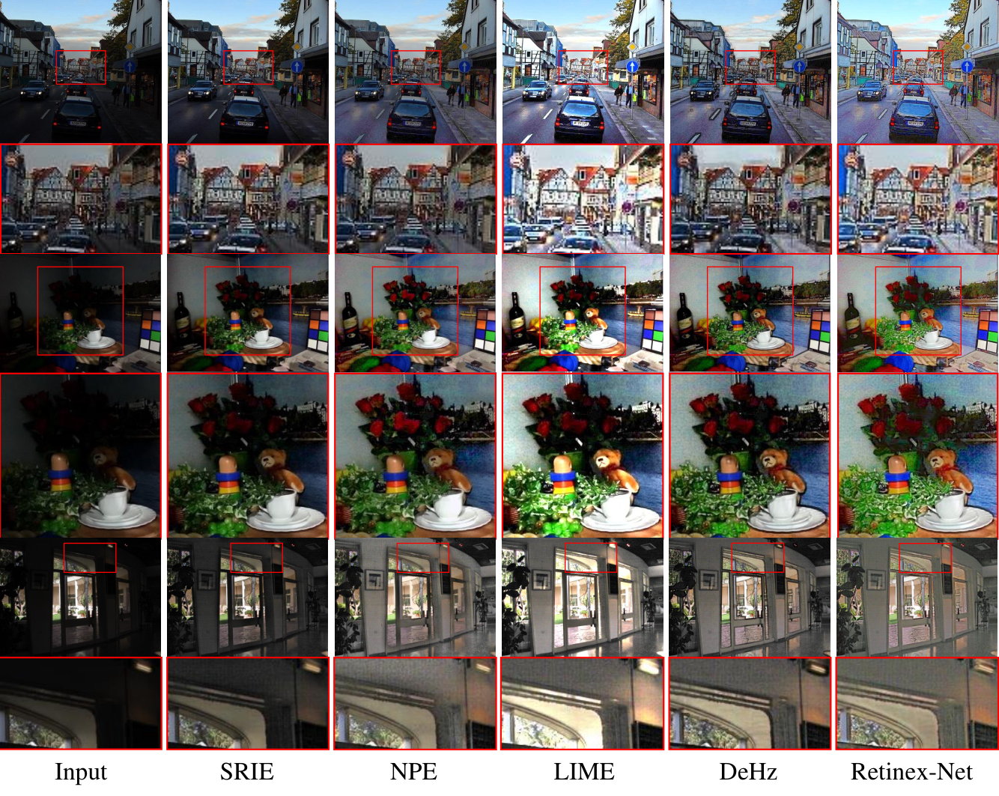

# RetinexNet: Deep Retinex Decomposition for Low-Light Enhancement

This is a TensorFlow implementation of RetinexNet, a deep learning framework for low-light image enhancement based on Retinex theory.

Original Paper: [Deep Retinex Decomposition for Low-Light Enhancement](https://arxiv.org/abs/1808.04560) (BMVC'18 Oral Presentation)<br>
Authors: [Chen Wei*](https://weichen582.github.io/), [Wenjing Wang*](https://daooshee.github.io/website/), [Wenhan Yang](https://flyywh.github.io/), [Jiaying Liu](http://www.icst.pku.edu.cn/struct/people/liujiaying.html) (* indicates equal contributions)

## Overview

RetinexNet is a deep learning framework that decomposes a low-light image into its reflectance and illumination components, then enhances the illumination to produce a better-lit image. The implementation includes:

1. **DecomNet**: A lightweight CNN that decomposes input images into reflectance and illumination maps
2. **RelightNet**: An encoder-decoder network that enhances the illumination map
3. **BM3D Denoising**: Applied to the reflectance component to reduce noise

## Requirements

- Python 3.x
- TensorFlow >= 1.5.0
- NumPy
- Pillow (PIL)
- BM3D (for denoising)

## Installation

1. Clone this repository:
```bash
git clone https://github.com/yourusername/RetinexNet.git
cd RetinexNet
```

2. Install dependencies:
```bash
pip install -r requirements.txt
```

## Project Structure

```
RetinexNet/
├── main.py              # Main script for training and testing
├── model.py             # Network architecture and training logic
├── utils.py             # Utility functions for data processing
├── data/                # Data directory
│   ├── our485/         # Real-world low/high image pairs
│   ├── syn/            # Synthetic low/high image pairs
│   └── eval/           # Evaluation images
├── checkpoint/         # Saved model checkpoints
├── sample/            # Sample outputs during training
└── test_results/      # Test results
```

## Usage

### Testing

To test the model on your own images:

```bash
python main.py \
    --use_gpu=1 \           # Use GPU (1) or CPU (0)
    --gpu_idx=0 \           # GPU index
    --gpu_mem=0.5 \         # GPU memory usage (0-1)
    --phase=test \
    --test_dir=/path/to/test/images/ \
    --save_dir=/path/to/save/results/ \
    --decom=0               # 0: save only enhanced results, 1: save decomposition results
```

For a quick demo:
```bash
python main.py --phase=test
```

### Training

1. Download the training dataset from the [project page](https://daooshee.github.io/BMVC2018website/)
2. Place the training pairs in the appropriate directories:
   - Real-world pairs: `./data/our485/`
   - Synthetic pairs: `./data/syn/`

3. Start training:
```bash
python main.py \
    --use_gpu=1 \           # Use GPU (1) or CPU (0)
    --gpu_idx=0 \           # GPU index
    --gpu_mem=0.5 \         # GPU memory usage (0-1)
    --phase=train \
    --epoch=100 \           # Number of training epochs
    --batch_size=16 \       # Batch size
    --patch_size=48 \       # Size of training patches
    --start_lr=0.001 \      # Initial learning rate
    --eval_every_epoch=20 \ # Evaluate and save checkpoints every N epochs
    --checkpoint_dir=./checkpoint \
    --sample_dir=./sample
```

## Model Architecture

### DecomNet
- 5-layer CNN for image decomposition
- Input: Low-light image
- Output: Reflectance and illumination maps
- Uses ReLU and Sigmoid activations

### RelightNet
- Encoder-decoder architecture
- 3 down-sampling and 3 up-sampling blocks
- Skip connections for better detail preservation
- Multi-scale feature concatenation

### Loss Functions
1. Reconstruction Loss (Lrecon)
2. Reflectance Consistency Loss (Lir)
3. Edge-aware Illumination Smoothness Loss (Lis)

## Notes

- The model is relatively lightweight and can be trained quickly on a GPU
- Training parameters significantly affect enhancement quality
- BM3D denoising is applied to the reflectance component to reduce noise
- The implementation uses TensorFlow 1.x compatibility mode

## Citation

If you use this code in your research, please cite the original paper:

```bibtex
@inproceedings{Chen2018Retinex,
  title={Deep Retinex Decomposition for Low-Light Enhancement},
  author={Chen Wei, Wenjing Wang, Wenhan Yang, Jiaying Liu},
  booktitle={British Machine Vision Conference},
  year={2018},
  organization={British Machine Vision Association}
}
```

## License

This project is licensed under the MIT License - see the [LICENSE](LICENSE) file for details.


